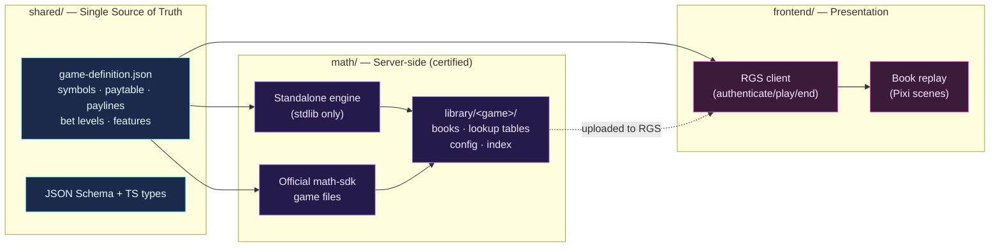

<div align="center">

# ✦ AetherSpin ✦

### A production-grade Stake Engine slot-game studio monorepo

**Reusable Python math engine + PixiJS web client + shared single-source-of-truth game definition — with the flagship neon-cosmic slot _NovaForged_ built end to end.**

[](.github/workflows/ci.yml)
[](.github/workflows/math-validation.yml)
[](LICENSE)
[](package.json)
[](package.json)
[](math/requirements.txt)

</div>

---

## What is this?

**AetherSpin** is a reusable _game studio starter kit_ for building, certifying, and shipping
[Stake Engine](https://stakeengine.com) slot games. It pairs a fast, dependency-free Python
**math engine** with a **PixiJS + Svelte + TypeScript** web client, joined by a single
canonical **`game-definition.json`** that both sides read so the math and the visuals can never
drift.

The repo ships with **NovaForged** — a complete, polished reference title:

> **NovaForged** — a premium **5×3, 20-line** neon-cosmic video slot. **Multiplier wilds**,
> **scatter-triggered free spins** with an escalating **×1 → ×3 multiplier ladder**, **expanding
> wilds** in free spins, and a **100× bonus buy**. RTP target **96.5%**, win cap **5000×**,
> **high volatility**.

Clone NovaForged, retune the numbers, and you have your next game.

---

## ✨ Feature highlights

- **Single source of truth** — one JSON file (`shared/games/<id>/game-definition.json`) drives
  symbols, paytable, paylines, bet levels, and feature config for _both_ the Python engine and
  the TypeScript frontend. Validated by a JSON Schema and mirrored by TS types.
- **Two complementary math paths** — a **stdlib-only standalone engine** for fast local dev / CI /
  RTP reporting / RGS-compatible book generation, and **official `StakeEngine/math-sdk`-compatible**
  game files for certified submission.
- **RGS-compatible output** — generates `books_<mode>.jsonl`, lookup tables, and config/index
  files in exactly the layout the Stake Engine dashboard expects.
- **Book-replay frontend** — the client never computes outcomes; it replays the math engine's
  ordered **book-event** stream to drive the presentation (provably fair, server-authoritative).
- **Batteries-included tooling** — Turborepo + pnpm workspaces, Vite, Vitest, ESLint, Prettier,
  pytest, GitHub Actions CI with an RTP gate, and a nightly deep-validation + PAR-sheet job.
- **Designed to be forked** — a `template/` game, a `new-game.sh` scaffold, ADRs, GDD/PAR
  templates, and end-to-end docs.

---

## 🏛 Architecture at a glance



```
AetherSpin/
├── shared/                       # Single source of truth (consumed by math + web)
│   ├── games/
│   │   ├── novaforged/game-definition.json   # the flagship game
│   │   └── template/game-definition.json      # clone this for a new game
│   ├── schemas/game-definition.schema.json    # validates every definition
│   └── src/types/{game,events}.ts             # TS contracts (incl. BookEvent vocabulary)
│
├── math/                         # Python math engine (server-authoritative)
│   ├── simulator/                # Standalone engine — STDLIB ONLY
│   │   ├── definition.py  engine.py  reels.py
│   │   ├── library.py     runner.py  rng.py
│   ├── scripts/                  # CLI: simulate, validate_rtp, generate_books, optimize, par sheet
│   ├── games/                    # Official-SDK game files (novaforged + template)
│   ├── library/<game>/           # Generated RGS output (gitignored)
│   ├── tests/                    # pytest (CI gate)
│   └── requirements.txt
│
├── frontend/                     # Vite + Svelte + TypeScript + PixiJS web client
│   └── src/{core,scenes,components,config,assets}
│
├── scripts/                      # setup-math.sh · new-game.sh · package-for-stake.sh
├── docs/                         # Architecture, guides, ADRs, templates, design docs
├── .github/workflows/            # ci · math-validation · release
├── package.json  pnpm-workspace.yaml  turbo.json
└── LICENSE
```

See **[docs/architecture.md](docs/architecture.md)** for the full picture.

---

## 🚀 Quickstart

### Prerequisites

| Tool        | Version | Notes                                         |
| ----------- | ------- | --------------------------------------------- |
| **Node.js** | ≥ 20    | Frontend + tooling                            |
| **pnpm**    | ≥ 10    | Workspace package manager (`corepack enable`) |
| **Python**  | ≥ 3.11  | Math engine (3.11 ships `tomllib`)            |

The standalone math engine is **stdlib-only** — no `pip install` needed to simulate or validate.

### 1. Install

```bash
git clone <repo-url> AetherSpin && cd AetherSpin
pnpm install            # frontend + shared workspaces
# Python math engine needs nothing for simulation; for tests/analysis:
pip install -r math/requirements.txt
```

### 2. Run the math simulation

```bash
python3 math/scripts/simulate.py --game novaforged --sims 100000
```

You'll see RTP, hit rate, free-spin frequency, win-cap rate, and max win for both bet modes.

### 3. Start the frontend

```bash
pnpm dev
# or just the web client:
pnpm --filter @aetherspin/frontend dev
```

The client boots against a **mock RGS** by default, so you can play locally without a server.

---

## 🔭 The two math paths

AetherSpin deliberately maintains **two interchangeable math implementations**:

|                  | **Standalone engine** (`math/simulator/`)     | **Official SDK** (`math/games/<game>/`)        |
| ---------------- | --------------------------------------------- | ---------------------------------------------- |
| **Dependencies** | Python **stdlib only**                        | `StakeEngine/math-sdk` + Rust toolchain        |
| **Speed to run** | Instant (`python3 ...`)                       | Requires SDK clone via `scripts/setup-math.sh` |
| **Use for**      | Local dev, CI, RTP reporting, book generation | **Certified submission**                       |
| **Output**       | `math/library/<game>/…` (RGS-compatible)      | Same `library/` layout, certified              |

Both read the **same `game-definition.json`** and the **same reel strips**, and both emit the
**same book-event vocabulary**, so they agree. The standalone path lets you iterate in seconds;
the SDK path produces the certified artifacts (millions of spins + the Rust optimizer).

Fetch the official SDK when you're ready to certify:

```bash
bash scripts/setup-math.sh      # clones StakeEngine/math-sdk into math/engine/
```

> Details: **[docs/adr/0002-two-math-paths-standalone-and-official-sdk.md](docs/adr/0002-two-math-paths-standalone-and-official-sdk.md)**
> and **[docs/math-engine.md](docs/math-engine.md)**.

---

## 🛠 Common commands

All math commands accept `--game <id>`; defaults shown are for NovaForged.

### (a) Simulate NovaForged

```bash
python3 math/scripts/simulate.py --game novaforged --sims 100000
python3 math/scripts/simulate.py --game novaforged --mode bonus --sims 50000   # bonus only
# flags: --game  --sims (per mode)  --mode [base|bonus|all]  --seed
```

### (b) Validate RTP (CI gate — exits non-zero on failure)

```bash
python3 math/scripts/validate_rtp.py --game novaforged --sims 200000 --tol 0.02
# flags: --game  --sims  --tol (absolute RTP tolerance)  --seed
```

### (c) Generate the RGS book library

```bash
python3 math/scripts/generate_books.py --game novaforged --sims 100000
# writes math/library/novaforged/{books, lookup_tables, configs, index.json}
# flags: --game  --sims  --seed  --out
```

### (d) Run the frontend dev server

```bash
pnpm --filter @aetherspin/frontend dev     # Vite dev server (mock RGS)
```

### (e) Package for Stake Engine upload

```bash
bash scripts/package-for-stake.sh novaforged
# assembles dist-stake/novaforged/ with the math library + frontend production bundle
```

> Tip: the root `package.json` exposes shortcuts — `pnpm math:simulate`, `pnpm math:validate`,
> `pnpm math:books`, `pnpm package:stake`, `pnpm setup:math`.

---

## 🎮 How to develop a NEW game

1. **Scaffold** — `bash scripts/new-game.sh my_game` clones the template into
   `shared/games/my_game/` and `math/games/my_game/`.
2. **Define** — edit `shared/games/my_game/game-definition.json` (symbols, paytable, paylines,
   features). It's the only file both engine and frontend read.
3. **Design reels** — author `BR0.csv` (base) and `FR0.csv` (free) strips.
4. **Tune** — `simulate`, then `optimize.py`, then `validate_rtp.py` until RTP hits target.
5. **Wire the frontend** — point the client config at your game and add assets.
6. **Package & submit** — `package-for-stake.sh`, then follow the submission checklist.

Full walkthrough with a worked example: **[docs/developing-a-new-game.md](docs/developing-a-new-game.md)**.

---

## ✅ Stake Engine submission checklist (summary)

Before uploading version 1.0 you need:

- **Math library** — `books_<mode>.jsonl`, `lookUpTable_<mode>.csv`,
  `lookUpTableIdToCriteria_<mode>.csv`, `config.json`, `index.json`.
- **RTP / PAR documentation** — measured RTP per mode within target tolerance; a PAR sheet
  (`generate_par_sheet.py`).
- **Frontend production bundle** — `pnpm --filter @aetherspin/frontend build`.
- **Mandatory UI** — balance, bet levels, win display, paytable/rules, autoplay, responsible-gaming notes.
- **RGS integration** — authenticate / play / end-round with error handling.

The full, professional checklist and the exact dashboard upload steps live in
**[docs/stake-engine-submission-checklist.md](docs/stake-engine-submission-checklist.md)**.

---

## 🧰 Tech stack

| Layer            | Technology                                                               |
| ---------------- | ------------------------------------------------------------------------ |
| Monorepo         | pnpm workspaces · Turborepo                                              |
| Math engine      | Python 3.11 (stdlib standalone) · `StakeEngine/math-sdk` (certification) |
| Math analysis    | numpy · pandas · pytest (optional)                                       |
| Frontend runtime | Svelte 4 · TypeScript 5 · PixiJS 8 · Vite 5                              |
| Audio            | Howler                                                                   |
| Frontend test/QA | Vitest · svelte-check · ESLint · Storybook                               |
| Formatting       | Prettier (+ prettier-plugin-svelte)                                      |
| CI/CD            | GitHub Actions                                                           |

---

## 🧪 Testing & CI

| Workflow                  | Trigger          | What it does                                                                                        |
| ------------------------- | ---------------- | --------------------------------------------------------------------------------------------------- |
| **`ci.yml`**              | every push / PR  | pytest math tests + **RTP gate** (`validate_rtp.py`), frontend check + test + build, repo-wide lint |
| **`math-validation.yml`** | nightly + manual | deep RTP validation (1,000,000 sims) and PAR-sheet artifact                                         |
| **`release.yml`**         | `v*` tag         | packages the Stake bundle and attaches it to the GitHub release                                     |

Run locally:

```bash
python -m pytest math/tests -q                       # math unit tests
pnpm --filter @aetherspin/frontend run check         # type-check
pnpm --filter @aetherspin/frontend test              # vitest
pnpm format:check                                    # prettier
```

---

## 📈 Project status & roadmap

**Status:** NovaForged math is complete and RTP-validated on the standalone engine; the
official-SDK game files are written and run once the SDK is fetched. The frontend is under
active construction (core, scenes, components).

- [x] Shared single-source-of-truth definition + schema + TS types
- [x] Standalone stdlib math engine (simulate / validate / books / optimize / PAR)
- [x] Official-SDK-compatible NovaForged game files
- [x] CI with RTP gate + nightly deep validation
- [ ] Frontend feature-complete (reels, free-spin scene, paytable/rules, autoplay)
- [ ] Official-SDK certified run + dashboard submission
- [ ] Second reference game from the template

---

## 📚 Documentation

| Doc                                                                               | What's inside                                           |
| --------------------------------------------------------------------------------- | ------------------------------------------------------- |
| [architecture.md](docs/architecture.md)                                           | Full system architecture + data flow + event vocabulary |
| [math-engine.md](docs/math-engine.md)                                             | Deep dive on the standalone engine and RTP tuning       |
| [frontend.md](docs/frontend.md)                                                   | Frontend architecture & dev guide                       |
| [developing-a-new-game.md](docs/developing-a-new-game.md)                         | Step-by-step new-game guide                             |
| [stake-engine-submission-checklist.md](docs/stake-engine-submission-checklist.md) | Pre-submission checklist + upload steps                 |
| [novaforged-design.md](docs/novaforged-design.md)                                 | The filled-in NovaForged game design document           |
| [adr/](docs/adr/)                                                                 | Architecture Decision Records                           |
| [templates/](docs/templates/)                                                     | GDD + PAR-sheet templates                               |

---

## 📄 License

[MIT](LICENSE) © 2026 AetherSpin Studio
