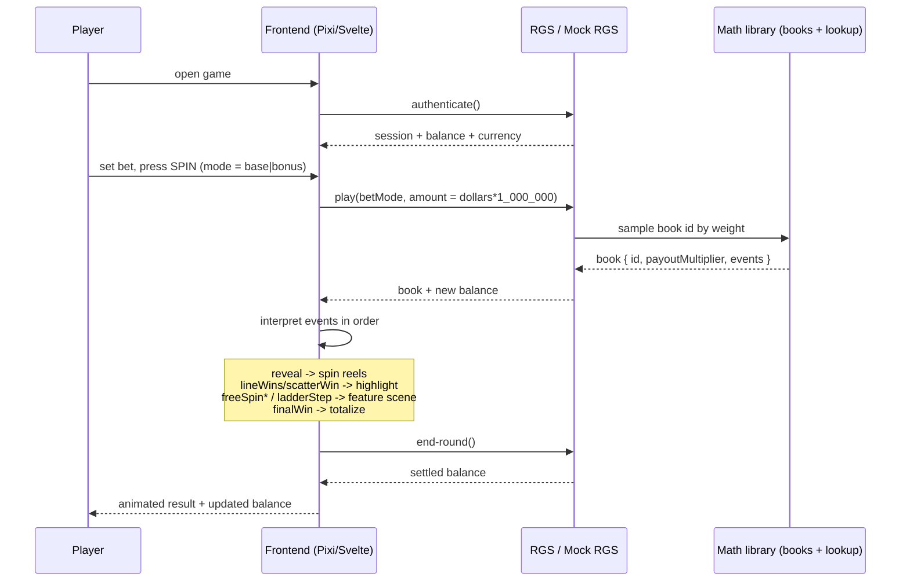

# Architecture

This document describes how AetherSpin is put together: the monorepo layout, the shared
game-definition as the single source of truth, the two-path math engine, the book/lookup-table
output format, the frontend architecture, the complete book-event vocabulary, and the end-to-end
data flow from authentication to a rendered round.

---

## 1. Monorepo layout

AetherSpin is a pnpm + Turborepo monorepo with three top-level domains plus tooling:

```
shared/      Canonical game definitions, JSON Schema, TypeScript contracts (consumed by both sides)
math/        Python math engine — server-authoritative outcomes (two interchangeable paths)
frontend/    Vite + Svelte + TypeScript + PixiJS web client — pure presentation
scripts/     setup-math.sh · new-game.sh · package-for-stake.sh
docs/        This documentation set
```

- **pnpm workspaces** (`pnpm-workspace.yaml`) cover `frontend` and `shared`. The math engine is
  Python and lives outside the JS workspace graph.
- **Turborepo** (`turbo.json`) orchestrates `build`, `dev`, `lint`, `test`, `check` across the JS
  workspaces with caching.
- The math engine is invoked directly with `python3` (or the `pnpm math:*` shortcuts in the root
  `package.json`).

### Why a monorepo?

Math and presentation share one contract — the game definition and the book-event vocabulary.
Keeping them in one repo means a change to the paytable or an event shape is reviewed, tested, and
versioned atomically. See [adr/0001-monorepo-and-tooling.md](adr/0001-monorepo-and-tooling.md).

---

## 2. The shared game definition (single source of truth)

Every game is defined by exactly one file:

```
shared/games/<game-id>/game-definition.json
```

It is validated by `shared/schemas/game-definition.schema.json` (JSON Schema draft-07) and mirrored
by the TypeScript interfaces in `shared/src/types/game.ts`. **Three independent consumers read it:**

| Consumer               | How it reads the definition                                                 |
| ---------------------- | --------------------------------------------------------------------------- |
| Standalone math engine | `math/simulator/definition.py` → `GameDefinition` dataclass                 |
| Official-SDK game      | `math/games/<game>/game_config.py` → `_load_shared_definition()`            |
| Frontend               | `frontend/src/config/gameConfig.ts` imports the JSON directly with TS types |

Because all three read the same file, the math and the visuals **cannot drift** on symbols,
paytable, paylines, bet levels, or feature parameters. See
[adr/0003-shared-game-definition-single-source-of-truth.md](adr/0003-shared-game-definition-single-source-of-truth.md).

### Top-level fields

| Field                                                            | Purpose                                                                                                   |
| ---------------------------------------------------------------- | --------------------------------------------------------------------------------------------------------- |
| `id`, `displayName`, `version`, `studio`, `theme`, `description` | Identity / metadata                                                                                       |
| `engine`                                                         | `type` (lines/ways/cluster/scatter), `numReels`, `numRows`, `wincapMultiplier`, `rtpTarget`, `volatility` |
| `currency`                                                       | `default`, `apiAmountMultiplier` (=1,000,000), `bookAmountMultiplier` (=100)                              |
| `bet`                                                            | `levels[]`, `defaultLevelIndex`, `minBet`, `maxBet`, `stepBet`                                            |
| `betModes[]`                                                     | `name`, `cost`, `label`, `isBuyBonus` (base + bonus)                                                      |
| `symbols[]`                                                      | `id`, `name`, `kind` (wild/scatter/high/low/bonus), `color`, `substitutes[]`                              |
| `paytable`                                                       | `{ symbol: { count: multiplier } }`                                                                       |
| `paylines[]`                                                     | each is a `[row,row,row,row,row]` pattern over the reels (0 = top row)                                    |
| `scatter`                                                        | `symbol`, `minToTrigger`, `pays`                                                                          |
| `features`                                                       | `freeSpins`, `multiplierWilds`, `expandingWilds`, `bonusBuy`                                              |

> The **two amount multipliers** are central to the data model. **API amounts** are integers equal
> to `dollars × 1,000,000` (the RGS protocol unit). **Book payouts** are stored as integers equal
> to `multiplier × 100` ("book units") in the lookup tables. The frontend and library writers both
> honour these constants.

---

## 3. The math engine

The math engine produces, for each possible round, a **book** (an ordered list of events) and a
**payout multiplier**. The frontend never computes outcomes — it replays books. AetherSpin keeps
two interchangeable implementations.

### 3.1 Standalone engine (`math/simulator/`) — stdlib only

Fast, hermetic, zero-dependency. Used for local dev, CI, RTP reporting, and book generation.

| Module          | Responsibility                                                                          |
| --------------- | --------------------------------------------------------------------------------------- |
| `definition.py` | Typed loader over `game-definition.json` (`GameDefinition` dataclass + accessors)       |
| `reels.py`      | `ReelSet` — loads `BR0.csv`/`FR0.csv`, windows a visible board, weighted stop sampling  |
| `rng.py`        | `Rng` — deterministic, seedable wrapper over `random.Random` (single RNG choke point)   |
| `engine.py`     | `LinesEngine` — board draw, line + scatter evaluation, free-spin orchestration, win cap |
| `runner.py`     | Orchestration — run simulations, measure stats, build the library                       |
| `library.py`    | `LibraryWriter` — writes the RGS-compatible `library/<game>/` output                    |

A round is evaluated by `LinesEngine.play_round()`:

1. Draw the base board from `BR0` and emit a `reveal` event.
2. Evaluate the 20 paylines left-aligned with wild substitution → `lineWins`.
3. Evaluate scatters → `scatterWin`; if `count ≥ minToTrigger`, run the free game.
4. Free game: spins from the award table, expanding wilds on the middle reels, an escalating
   global multiplier ladder, retriggers, and a `winScale` tuning factor.
5. Clamp the round to the win cap and emit `finalWin`.

Full mechanics, the multiplier ladder, and the two-knob RTP tuning are documented in
[math-engine.md](math-engine.md).

### 3.2 Official SDK game (`math/games/<game>/`)

These files target the official `StakeEngine/math-sdk` API (`Config`, `BetMode`, `Distribution`,
`GeneralGameState`). They become runnable after `bash scripts/setup-math.sh` clones the SDK into
`math/engine/`. They read the **same** `game-definition.json` and the **same** reel CSVs, and they
emit the **same** event vocabulary, so the two paths agree.

| File                                           | Role                                                                             |
| ---------------------------------------------- | -------------------------------------------------------------------------------- |
| `game_config.py`                               | Symbols, paytable, paylines, reels, bet modes, **distributions** (forcing files) |
| `gamestate.py`                                 | `run_spin()` — orchestrates one simulated round                                  |
| `game_executables.py` / `game_calculations.py` | Orchestration steps / pure win math                                              |
| `game_events.py`                               | Book-event factories                                                             |
| `game_override.py`                             | State init + per-round resets                                                    |
| `game_optimization.py`                         | Optimizer targets/conditions                                                     |
| `run.py` / `run_config.toml`                   | Pipeline entry point + runtime config (sim counts, threads)                      |

The SDK path runs production sample sizes (1,000,000 base + 200,000 bonus per `run_config.toml`)
and applies the **Rust optimizer** to tighten RTP for certification. See
[adr/0002-two-math-paths-standalone-and-official-sdk.md](adr/0002-two-math-paths-standalone-and-official-sdk.md).

### 3.3 Library output format

Both paths write `math/library/<game>/` in the layout the Stake Engine dashboard expects:

```
library/<game>/
├── books/
│   └── books_<mode>.jsonl                    # one JSON book per line
├── lookup_tables/
│   ├── lookUpTable_<mode>.csv                # id,weight,payout(book units)
│   └── lookUpTableIdToCriteria_<mode>.csv    # id,criteria
├── configs/
│   └── config.json                           # RGS math config (modes, costs, measured RTP)
└── index.json                                # manifest: modes -> files
```

A **book** is one simulated round:

```json
{
  "id": 1,
  "payoutMultiplier": 0.4715,
  "events": [
    { "type": "reveal", "gameType": "base", "board": [["L3","L2","L1"], ...], "reelStops": [23,55,40,39,41] },
    { "type": "finalWin", "amount": 0.4715, "wincap": false }
  ]
}
```

The **lookup table** maps each book id to a selection weight and its payout in book units
(`multiplier × 100`). The RGS samples a book id by weight, returns the recorded payout, and the
client replays that book's events. Example (`lookUpTable_base.csv`):

```
1,1,47        # book 1, weight 1, payout 0.47x
2,1,24        # book 2, weight 1, payout 0.24x
3,1,0         # book 3, weight 1, no win
```

`lookUpTableIdToCriteria_<mode>.csv` tags each book with a criteria label
(`0`, `basegame`, `freegame`, `wincap`) used by the optimizer and for analysis:

```
1,basegame
2,basegame
3,0
```

`config.json` records the per-mode cost, `isBuyBonus`, and measured RTP; `index.json` is the
file manifest the dashboard reads.

---

## 4. The frontend

The frontend is a **Vite + Svelte 4 + TypeScript 5 + PixiJS 8** single-page web client built to run
inside the Stake CDN iframe (`vite.config.ts` sets `base: "./"` for path-independent serving).

### 4.1 Source structure

```
frontend/src/
├── core/         RGS client, mock RGS, book-event interpreter, game state stores
├── scenes/       Pixi scenes (e.g. base game, free-spins) — the visual layers
├── components/   Svelte UI components (balance, bet selector, win display, paytable, autoplay)
├── config/       gameConfig.ts — typed access layer over game-definition.json
└── assets/       Sprites, atlases, audio
```

> The frontend directory is under active construction. `config/gameConfig.ts` and `vite.config.ts`
> are present; `core/`, `scenes/`, and `components/` are described here at the architectural level.
> See [frontend.md](frontend.md) for the dev guide.

- **`config/gameConfig.ts`** is the only module that touches the raw definition. It exposes typed
  helpers (`getPayout`, `getSymbol`, `betLevels`, `paylines`, `formatCurrency`, `formatMultiplier`,
  `ladderConfig`, etc.) so no other module re-parses the JSON. It imports nothing from Pixi/Svelte.
- **`core/`** holds the **RGS client wrapper** (authenticate / play / end-round; amounts =
  `dollars × 1,000,000`), a **mock RGS** that serves generated books for local play, the
  **book interpreter** that walks `BookEvent`s, and reactive **stores** for balance, bet, and round
  state.
- **`scenes/`** are Pixi render layers that subscribe to interpreter output (reels spin to the
  `reveal` board, line wins highlight, free-spin scene shows the ladder).
- **`components/`** are the Svelte HUD chrome around the canvas.

### 4.2 RGS client and mock mode

The RGS client wraps three protocol calls:

| Call           | Purpose                                                                          |
| -------------- | -------------------------------------------------------------------------------- |
| `authenticate` | Establish a session, fetch the player's balance and currency                     |
| `play`         | Place a bet for a given bet mode; the RGS returns a **book** (the round outcome) |
| `end-round`    | Settle the round and finalize the balance                                        |

In **mock mode** the client serves books from a locally generated library
(`math/library/<game>/books_<mode>.jsonl`), so the full presentation can be developed and tested
with no server. This is the same data the real RGS serves, so behaviour is identical.

---

## 5. The book-event vocabulary

The **book-event vocabulary** is the contract between the math engine and the frontend, defined in
`shared/src/types/events.ts` and emitted by `math/simulator/engine.py` (the official SDK's
`game_events.py` is kept consistent with it). The frontend replays a book's `events` **in order** to
drive the presentation.

Common shapes:

```ts
type GameType = 'base' | 'free';
type Board = string[][]; // board[reel][row], top -> bottom

interface LineWin {
  line: number; // payline index
  symbol: string; // paying symbol id
  count: number; // matched symbols (3-5)
  wildMultiplier: number; // applied wild multiplier (1 in base, >1 possible in free)
  amount: number; // payout in bet-multiplier units
}
```

Every event type, with a real sample payload taken from a generated book:

### `reveal`

A new board is shown. Free-spin reveals carry spin counters, the global multiplier, and any
expanded reels.

```json
{
  "type": "reveal",
  "gameType": "base",
  "board": [
    ["L3", "L2", "L1"],
    ["L4", "L3", "L2"],
    ["L5", "L4", "L3"],
    ["L4", "L3", "L2"],
    ["H4", "L5", "L4"]
  ],
  "reelStops": [23, 55, 40, 39, 41]
}
```

Free-spin variant adds `spin`, `spinsTotal`, `globalMultiplier`, and optional `expandedReels`:

```json
{ "type": "reveal", "gameType": "free", "board": [ ... ], "reelStops": [ ... ], "spin": 3, "spinsTotal": 8, "globalMultiplier": 2, "expandedReels": [2] }
```

### `lineWins`

Base-game payline wins for the current board.

```json
{
  "type": "lineWins",
  "gameType": "base",
  "wins": [{ "line": 8, "symbol": "L5", "count": 3, "wildMultiplier": 1, "amount": 0.0945 }],
  "amount": 0.0945
}
```

### `scatterWin`

Scatter pays were awarded (independent of paylines).

```json
{ "type": "scatterWin", "count": 3, "amount": 2.0 }
```

### `freeSpinTrigger`

The base game triggered free spins. Carries the scatter count, spins awarded, and the starting
ladder multiplier.

```json
{ "type": "freeSpinTrigger", "scatters": 3, "awarded": 8, "startMultiplier": 1 }
```

### `freeSpinResult`

The result of one individual free spin: its line wins, optional scatter, the active global
multiplier, and the spin's total (after the multiplier and `winScale`).

```json
{
  "type": "freeSpinResult",
  "spin": 1,
  "wins": [{ "line": 5, "symbol": "L5", "count": 5, "wildMultiplier": 3, "amount": 5.7 }],
  "scatter": null,
  "globalMultiplier": 1,
  "amount": 12.75
}
```

### `ladderStep`

The global free-spin multiplier escalated by one step (emitted after a winning free spin).

```json
{ "type": "ladderStep", "globalMultiplier": 2 }
```

### `freeSpinRetrigger`

Additional scatters during free spins awarded extra spins; `spinsTotal` is the new total.

```json
{ "type": "freeSpinRetrigger", "scatters": 3, "awarded": 8, "spinsTotal": 16 }
```

### `freeSpinEnd`

The free-spin sequence finished; `totalWin` is the sum of free-spin wins (before win-cap clamp).

```json
{ "type": "freeSpinEnd", "totalWin": 120.1545 }
```

### `finalWin`

The terminating event of every book: the round's total payout multiplier and whether it hit the
win cap.

```json
{ "type": "finalWin", "amount": 122.249, "wincap": false }
```

> **Note on the two engines' factories.** The standalone engine emits the events above exactly as
> typed in `events.ts`. The official-SDK `game_events.py` uses the same `type` strings with a couple
> of SDK-shaped variants (`lineWin` per-win, `freeSpinUpdate`) that the interpreter normalizes. The
> canonical contract for the frontend is `shared/src/types/events.ts`.

---

## 6. End-to-end data flow



1. **authenticate** — session, balance, currency.
2. **play** — the client sends the bet (API amount = dollars × 1,000,000) for the chosen bet mode.
   The RGS samples a book by weight from the lookup table and returns it.
3. **book → visuals** — the client's interpreter walks the book's `events` in order and the Pixi
   scenes render each step. The payout is server-authoritative; the visuals merely depict it.
4. **end-round** — the round is settled and the balance finalized.

---

## 7. Math / frontend separation

The boundary is strict and deliberate:

| Concern                                                | Owner                                             |
| ------------------------------------------------------ | ------------------------------------------------- |
| Outcomes, RTP, win cap, fairness                       | **Math engine** (server-authoritative, certified) |
| Pixels, animation, sound, UX                           | **Frontend** (presentation only)                  |
| Shared truth (symbols, paytable, bet levels, features) | **`game-definition.json`**                        |
| The events that join them                              | **Book-event vocabulary** (`events.ts`)           |

The client **cannot** alter a payout — it only replays what the certified math produced. This is the
core fairness property of the Stake Engine model, and AetherSpin's architecture enforces it by
construction. See [adr/0004-pixi-svelte-frontend.md](adr/0004-pixi-svelte-frontend.md) for the
frontend technology decision.
