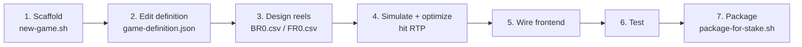

# Developing a New Game

This guide walks you through creating a brand-new AetherSpin / Stake Engine title, from scaffold to
packaged submission. The flagship **NovaForged** (`shared/games/novaforged/`,
`math/games/novaforged/`) is the fully worked reference — read it alongside this guide.

> **Prerequisites:** Node ≥ 20, pnpm ≥ 10, Python ≥ 3.11. The standalone math engine is stdlib-only,
> so you can simulate and validate without installing anything.

---

## Overview



---

## Step 1 — Scaffold the game

```bash
bash scripts/new-game.sh my_game
```

This clones the template into:

- `shared/games/my_game/game-definition.json` (from `shared/games/template/`)
- `math/games/my_game/` (from `math/games/template/` — config, gamestate, events, reels, run files)

> The game `id` must match `^[a-z0-9_]+$` (lowercase, digits, underscores) per the schema.

---

## Step 2 — Edit the game definition

Open `shared/games/my_game/game-definition.json`. It is the **single source of truth** — both the
Python engine and the TypeScript frontend read it (see
[architecture.md](architecture.md#2-the-shared-game-definition-single-source-of-truth)). It is
validated by `shared/schemas/game-definition.schema.json`.

### Every field explained

| Field                               | Meaning                                                                      | NovaForged example                   |
| ----------------------------------- | ---------------------------------------------------------------------------- | ------------------------------------ |
| `id`                                | Slug (`^[a-z0-9_]+$`), matches the directory name                            | `"novaforged"`                       |
| `displayName`                       | Player-facing title                                                          | `"NovaForged"`                       |
| `version`                           | SemVer; bump on math/visual changes                                          | `"1.0.0"`                            |
| `studio`, `theme`, `description`    | Metadata                                                                     | `"AetherSpin"`, `"neon-cosmic"`      |
| `engine.type`                       | `lines` \| `ways` \| `cluster` \| `scatter`                                  | `"lines"`                            |
| `engine.numReels` / `numRows`       | Board dimensions                                                             | `5` / `3`                            |
| `engine.wincapMultiplier`           | Max payout as a bet multiple (hard clamp)                                    | `5000.0`                             |
| `engine.rtpTarget`                  | Target return-to-player (0–1)                                                | `0.965`                              |
| `engine.volatility`                 | `low` \| `medium` \| `high` \| `very-high`                                   | `"high"`                             |
| `currency.default`                  | ISO code                                                                     | `"USD"`                              |
| `currency.apiAmountMultiplier`      | RGS integer unit = `dollars × this`                                          | `1000000`                            |
| `currency.bookAmountMultiplier`     | Book-unit integer = `multiplier × this`                                      | `100`                                |
| `bet.levels[]`                      | Selectable stake levels (dollars)                                            | `[0.1, …, 100.0]`                    |
| `bet.defaultLevelIndex`             | Index into `levels` shown first                                              | `2` (= 0.5)                          |
| `bet.minBet` / `maxBet` / `stepBet` | Bounds and increment                                                         | `0.1` / `100.0` / `0.1`              |
| `betModes[]`                        | `name`, `cost`, `label`, `isBuyBonus`                                        | `base` (1.0), `bonus` (100.0)        |
| `symbols[]`                         | `id`, `name`, `kind` (wild/scatter/high/low/bonus), `color`, `substitutes[]` | see below                            |
| `paytable`                          | `{ symbol: { count: multiplier } }` for counts 3–5                           | `"H1": {"3":33,"4":175,"5":885}`     |
| `paylines[]`                        | Each is a `[row,row,row,row,row]` pattern (0 = top)                          | 20 lines                             |
| `scatter`                           | `symbol`, `minToTrigger`, `pays`                                             | `S`, `3`, `{3:2,4:10,5:50}`          |
| `features.freeSpins`                | `enabled`, `awards`, `retrigger`, `winScale`, `multiplierLadder`             | see [math-engine.md](math-engine.md) |
| `features.multiplierWilds`          | `enabled`, `appliesIn`, `values`, `weights`                                  | `[2,3,5]` @ `[60,30,10]`             |
| `features.expandingWilds`           | `enabled`, `appliesIn`, `description`                                        | middle reels expand in free          |
| `features.bonusBuy`                 | `enabled`, `mode`, `costMultiplier`, `description`                           | buy free spins for 100×              |

The **wild** is the symbol with `kind: "wild"`; its `substitutes` list the symbols it can replace.
The **scatter** is referenced by `scatter.symbol`. High/low symbols differ only by paytable weight.

> Keep the official-SDK `math/games/my_game/game_config.py` in lock-step — it reads the same JSON
> via `_load_shared_definition()`, so most numbers are inherited automatically. Tune the SDK
> **distributions** (forcing-file quotas) there.

---

## Step 3 — Design the reel strips

Author `math/games/my_game/reels/BR0.csv` (base) and `FR0.csv` (free spins). Format:

```csv
R1,R2,R3,R4,R5
L5,L5,L5,L5,L5
L4,L4,L4,L4,L4
H1,L2,W,L3,S
...
```

- One column per reel (`R1`–`R5`), one strip position per row.
- Cells are symbol ids from your definition. Empty cells are ignored, so reels may differ in length.
- **Volatility** is governed mostly by strip composition: more high symbols and scatters clustered
  together → higher volatility. Wild and scatter frequency drive feature hit rate.
- The free strip (`FR0`) typically carries more wilds/scatters to make the feature feel rewarding
  (and to support expanding/multiplier wilds).

---

## Step 4 — Simulate and optimize to hit RTP

### Simulate to see where you stand

```bash
python3 math/scripts/simulate.py --game my_game --sims 100000
```

Reports RTP, hit rate, free-spin frequency, win-cap rate, and max win for `base` and `bonus`.

### Optimize the two knobs

Because a buy-bonus title has two RTP equations (base and bonus), use the two-knob solver — a global
**paytable scalar** and the free-spin **`winScale`** (see
[math-engine.md](math-engine.md#6-two-knob-rtp-tuning)):

```bash
python3 math/scripts/optimize.py --game my_game --sims 100000          # preview
python3 math/scripts/optimize.py --game my_game --sims 100000 --apply  # write back to the definition
```

### Validate (the CI gate)

```bash
python3 math/scripts/validate_rtp.py --game my_game --sims 200000 --tol 0.02
```

Exits non-zero if RTP is outside tolerance. Iterate on reels + the optimizer until it passes.

### Generate the book library

```bash
python3 math/scripts/generate_books.py --game my_game --sims 100000
# -> math/library/my_game/{books, lookup_tables, configs, index.json}
```

> For certified numbers, fetch the official SDK (`bash scripts/setup-math.sh`) and run
> `math/games/my_game/run.py` with production sample sizes from `run_config.toml`.

---

## Step 5 — Wire up the frontend

The frontend reads the definition through `frontend/src/config/gameConfig.ts`, which currently
imports NovaForged's JSON directly. To target your game:

1. Point `gameConfig.ts` at `shared/games/my_game/game-definition.json` (or parameterize it).
2. Add art/audio assets under `frontend/src/assets/` keyed by your symbol ids.
3. Add/adjust scenes in `frontend/src/scenes/` and HUD components in `frontend/src/components/` as
   needed for your feature set.

Run it against the mock RGS (it serves your freshly generated books):

```bash
pnpm --filter @aetherspin/frontend dev
```

See [frontend.md](frontend.md) for the architecture and conventions.

---

## Step 6 — Test

```bash
python -m pytest math/tests -q                       # math unit tests
python3 math/scripts/validate_rtp.py --game my_game --sims 200000 --tol 0.02
pnpm --filter @aetherspin/frontend run check         # type-check
pnpm --filter @aetherspin/frontend test              # vitest
pnpm format:check                                    # prettier
```

Generate a PAR sheet for your design review:

```bash
python3 math/scripts/generate_par_sheet.py --game my_game --sims 200000 --out docs/my_game-par-sheet.md
```

---

## Step 7 — Package for Stake Engine

```bash
bash scripts/package-for-stake.sh my_game
# -> dist-stake/my_game/ with the math library + frontend production bundle
```

Then follow [stake-engine-submission-checklist.md](stake-engine-submission-checklist.md) to upload
and certify.

---

## Worked mini-example — "Stardust" (5×3, 10-line)

A trimmed example based on the `template`:

```jsonc
{
  "id": "stardust",
  "displayName": "Stardust",
  "engine": {
    "type": "lines",
    "numReels": 5,
    "numRows": 3,
    "wincapMultiplier": 2500.0,
    "rtpTarget": 0.96,
    "volatility": "medium",
  },
  "bet": {
    "defaultLevelIndex": 2,
    "levels": [0.1, 0.2, 0.5, 1.0, 2.0, 5.0],
    "minBet": 0.1,
    "maxBet": 5.0,
    "stepBet": 0.1,
  },
  "betModes": [
    { "name": "base", "cost": 1.0, "isBuyBonus": false },
    { "name": "bonus", "cost": 80.0, "isBuyBonus": true },
  ],
  "symbols": [
    { "id": "W", "name": "Comet (Wild)", "kind": "wild", "substitutes": ["H1", "H2", "L1", "L2"] },
    { "id": "S", "name": "Nebula (Scatter)", "kind": "scatter" },
    { "id": "H1", "name": "Star", "kind": "high" },
    { "id": "H2", "name": "Moon", "kind": "high" },
    { "id": "L1", "name": "Blue Gem", "kind": "low" },
    { "id": "L2", "name": "Green Gem", "kind": "low" },
  ],
  "paytable": {
    "W": { "3": 25, "4": 120, "5": 600 },
    "H1": { "3": 15, "4": 75, "5": 375 },
    "H2": { "3": 10, "4": 50, "5": 250 },
    "L1": { "3": 5, "4": 20, "5": 100 },
    "L2": { "3": 4, "4": 15, "5": 75 },
  },
  "scatter": { "symbol": "S", "minToTrigger": 3, "pays": { "3": 2, "4": 10, "5": 50 } },
  "features": {
    "freeSpins": {
      "enabled": true,
      "awards": { "3": 8, "4": 12, "5": 20 },
      "retrigger": true,
      "winScale": 1.0,
      "multiplierLadder": { "description": "Bumps on a win.", "start": 1, "step": 1, "max": 3 },
    },
    "multiplierWilds": { "enabled": true, "appliesIn": ["free"], "values": [2, 3], "weights": [70, 30] },
    "expandingWilds": { "enabled": false, "appliesIn": ["free"], "description": "Disabled." },
    "bonusBuy": {
      "enabled": true,
      "mode": "bonus",
      "costMultiplier": 80.0,
      "description": "Buy free spins for 80x.",
    },
  },
}
```

Then:

```bash
python3 math/scripts/simulate.py --game stardust --sims 100000
python3 math/scripts/optimize.py --game stardust --sims 100000 --apply
python3 math/scripts/validate_rtp.py --game stardust --sims 200000 --tol 0.02
python3 math/scripts/generate_books.py --game stardust --sims 100000
```

When RTP passes and the library is generated, wire the frontend, test, and package. You have a new
game.
