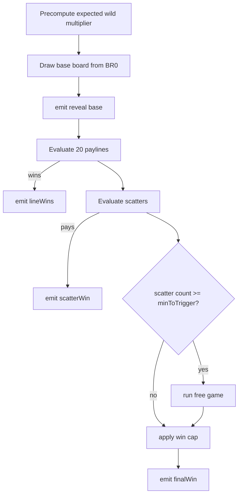
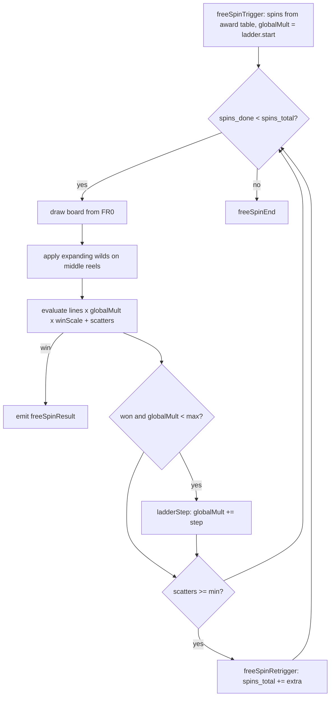

# Math Engine Deep Dive

This is a deep dive on the **standalone math engine** (`math/simulator/`) that powers NovaForged:
how one round is simulated, how lines and scatters are evaluated with wild substitution, how the
free game is orchestrated (the escalating multiplier ladder, multiplier wilds, expanding wilds), the
two-knob RTP tuning, why the buy-bonus is balanced separately, and how the generated books and
lookup tables map onto the RGS.

> The standalone engine is **stdlib only** — it runs with `python3` and needs no `pip install`. The
> official `StakeEngine/math-sdk` game files (`math/games/<game>/`) implement the same mechanics for
> certification; see [architecture.md](architecture.md#3-the-math-engine).

---

## 1. Module map

| Module          | Responsibility                                                  |
| --------------- | --------------------------------------------------------------- |
| `definition.py` | `GameDefinition` — typed view over `game-definition.json`       |
| `reels.py`      | `ReelSet` — load strips, window a board, weighted stop sampling |
| `rng.py`        | `Rng` — deterministic, seedable RNG (single choke point)        |
| `engine.py`     | `LinesEngine` — evaluation + round orchestration                |
| `runner.py`     | run simulations, measure stats, build the library               |
| `library.py`    | `LibraryWriter` — RGS-compatible output                         |

The engine is constructed by `runner.build_engine(game_id)`, which loads the definition and the two
reel sets (`BR0.csv` base, `FR0.csv` free) from `math/games/<game>/reels/`.

---

## 2. Anatomy of one round (`LinesEngine.play_round`)

A round produces a `SpinResult(payout_multiplier, events, triggered_freegame, hit_wincap)`:



1. **Board draw** (`_draw_board`) — for each reel, sample a random stop on its strip and take a
   `numRows`-tall window (wrapping around the strip). Returns `board[reel][row]` plus the stops.
2. **Line evaluation** (`_evaluate_lines`) — for each of the 20 paylines, read the symbols on that
   pattern and evaluate a left-aligned win.
3. **Scatter evaluation** (`_evaluate_scatter`) — count scatters anywhere on the board, pay from the
   scatter table.
4. **Free-game trigger** — if scatters ≥ `minToTrigger`, orchestrate the free game.
5. **Win cap** (`_apply_cap`) — clamp the round total to `wincapMultiplier` (5000×) and flag it.

All payouts are expressed as a **multiple of the total bet**.

---

## 3. Line evaluation with wild substitution

For a single payline (`_evaluate_single_line`):

1. **Pick the paying symbol** — scan left to right; the first non-wild, non-scatter symbol is the
   paying symbol. If the line opens with wilds and no paid symbol resolves it, the line pays as a
   **wild line** (the wild has its own paytable entry).
2. **Count the run** — extend the run while each symbol equals the paying symbol **or** the wild
   (wilds substitute). Stop at the first mismatch. (Scatters break the run.)
3. **Look up the pay** — use the paytable for `(paying symbol, count)`. If the exact count doesn't
   pay (e.g. 5 wilds but the symbol only lists 3–5), fall back to the longest paying count.
4. **Line payout** — `(paytable_value / numPaylines) × wildMultiplier`. Dividing by the payline
   count keeps paytable values readable as "per-line" multipliers while the round total stays a
   bet multiple.

```python
payout = (line_value / self.num_lines) * mult
```

In the **base game**, `wildMultiplier` is always `1`. In the **free game**, lines containing a wild
receive the expected wild multiplier (see §5).

---

## 4. Free-game orchestration (`_run_freegame`)



- **Spins awarded** come from `features.freeSpins.awards` keyed by triggering scatter count
  (`3→8, 4→12, 5→20`).
- Each free spin draws from the **free reel set** `FR0`.
- **Expanding wilds** (`_apply_expanding_wilds`): on the **middle three reels** (0-indexed reels
  1, 2, 3), any reel containing a wild expands to a **full column of wilds**; expanded reels are
  reported in the `reveal` event's `expandedReels`.
- The spin win is `(lineTotal + scatterTotal) × globalMultiplier × winScale`.
- **Retrigger**: extra scatters add more spins (`spins_total += awards[count]`).

---

## 5. The escalating multiplier ladder & wild multipliers

### Global multiplier ladder

`features.freeSpins.multiplierLadder` defines a **global** multiplier applied to every free spin:

| Field   | NovaForged value |
| ------- | ---------------- |
| `start` | 1                |
| `step`  | 1                |
| `max`   | 3                |

It begins at `start` and increases by `step` after **any winning free spin**, capped at `max`
(×1 → ×2 → ×3). Each escalation emits a `ladderStep` event. The current value rides on every
free-spin `reveal` (`globalMultiplier`) and `freeSpinResult`.

### Multiplier wilds

`features.multiplierWilds` applies **only in the free game**:

| Values      | Weights        | Expected value                               |
| ----------- | -------------- | -------------------------------------------- |
| `[2, 3, 5]` | `[60, 30, 10]` | `(2·60 + 3·30 + 5·10)/100 = 2.6 → round → 3` |

To keep volatility bounded and RTP tractable, the engine uses the **rounded weighted-expectation**
wild multiplier as a single per-line factor rather than stacking each wild's draw multiplicatively
(`_expected_wild_mult`, precomputed per round). A free-spin line containing a wild therefore pays
its base value × this factor × the global ladder multiplier.

---

## 6. Two-knob RTP tuning

NovaForged must hit its RTP target in **two modes at once**: the base game and the 100× buy-bonus.
That's two equations, so the engine exposes **two decoupled knobs**:

| Knob                         | Where                             | Affects                          |
| ---------------------------- | --------------------------------- | -------------------------------- |
| **Paytable scalar** `a`      | multiplies every `paytable` value | base line wins **and** free wins |
| **Free-spin `winScale`** `b` | `features.freeSpins.winScale`     | free-spin wins **only**          |

`math/scripts/optimize.py` measures three reference quantities, then solves a 2×2 system:

```
line_only    = E[base line+scatter wins, free disabled]
base_total   = E[full base round]            -> free_contrib = base_total - line_only
E[free]      = E[forced-free round at cost 1]  (this is the buy RTP at 100x)

bonus:  E[free] · a · b = target          ->  a·b = K = target / E[free]
base :  line_only·a + free_contrib·a·b = target

Solve:  a = (target - free_contrib·K) / line_only ,   b = K / a
```

Run it:

```bash
python3 math/scripts/optimize.py --game novaforged --sims 100000        # preview (dry run)
python3 math/scripts/optimize.py --game novaforged --sims 100000 --apply # write a, b back
```

With `--apply` it scales every paytable entry by `a` and multiplies the existing `winScale` by `b`,
writing both back into `shared/games/novaforged/game-definition.json`. Because the definition is the
single source of truth, the frontend picks the new numbers up automatically.

> This standalone optimizer is the dependency-free counterpart to the official math-sdk **Rust
> optimizer**, which adjusts per-book selection weights over millions of spins to land RTP precisely
> for certification.

### Validate after tuning

```bash
python3 math/scripts/validate_rtp.py --game novaforged --sims 200000 --tol 0.02
```

`validate_rtp.py` exits non-zero if `|measured − target| > tol`, which is what gates CI. High-
volatility titles need large samples to converge — the default tolerance is generous, and the
official Rust optimizer tightens it for certification.

---

## 7. Why the buy-bonus is balanced separately

The buy-bonus lets a player pay **100× the base bet** to enter free spins immediately. If the
free-spin EV were simply 100× a base spin's free contribution, the buy could easily become
**player-EV-positive** (RTP > 100%), which is not permitted.

The two-knob solver pins **both** equations to the same `rtpTarget`, so the buy returns the target
RTP **measured against its higher cost** — not against the base bet. In `runner.py` the buy-mode
payout is divided by the bonus cost before measuring:

```python
payout = result.payout_multiplier / cost if is_buy else result.payout_multiplier
```

A unit test enforces this property:

```python
def test_buy_bonus_not_player_positive():
    out = run_simulations("novaforged", {"bonus": 20000}, seed=3)
    assert out.stats["bonus"].rtp < 1.15
```

> **Measured figures are sample- and seed-dependent.** On the standalone engine the base RTP lands
> near the 96.5% target (≈94.9–96.3% depending on seed/sample) and the buy-bonus near target, with a
> ~32% hit rate and free spins roughly 1 in ~130. The **certified** figures come from the official
> SDK's millions-of-spins run plus the Rust optimizer; the standalone numbers are engineering
> estimates that gate CI.

---

## 8. How books & lookup tables map to the RGS

`runner.run_simulations` plays N rounds per mode, records each as a book, tags it with a criteria
label (`self_criteria`: `wincap` / `freegame` / `basegame` / `0`), and assigns a selection weight
(1 each in the standalone engine; the optimizer reweights for certification). `write_library` then
emits the RGS-compatible files via `LibraryWriter`:

```
library/<game>/
  books/books_<mode>.jsonl                       # { id, payoutMultiplier, events }
  lookup_tables/lookUpTable_<mode>.csv           # id, weight, payout = round(mult * 100)
  lookup_tables/lookUpTableIdToCriteria_<mode>.csv  # id, criteria
  configs/config.json                            # modes, costs, measured RTP, bookAmountMultiplier
  index.json                                     # manifest of modes -> files
```

At play time the RGS:

1. Picks a **book id by weight** from `lookUpTable_<mode>.csv`.
2. Returns the recorded **payout** (book units ÷ 100 = bet multiplier) — server-authoritative.
3. Hands the book's `events` to the client, which **replays** them for the visuals.

Generate the library:

```bash
python3 math/scripts/generate_books.py --game novaforged --sims 100000
```

This is the data the frontend's mock RGS serves locally and the real RGS serves in production —
identical books, identical behaviour.

---

## 9. Determinism & testing

`Rng` wraps `random.Random` so every simulation index maps to a fixed seed; runs are fully
reproducible and the engine has one place to later swap in a certified RNG source. The hermetic,
stdlib-only `math/tests/test_engine.py` asserts structural correctness (board shape, event order,
forced free-game triggers), the win-cap invariant, RTP sanity, and the buy-bonus property — and
gates every CI run alongside `validate_rtp.py`.
